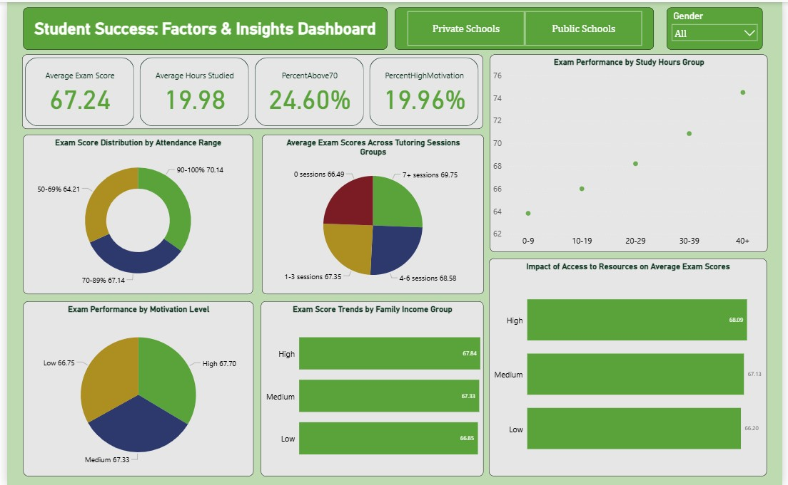

# 🎓 Student Success Insights Dashboard – Power BI

## 1. Executive Summary
Students' academic outcomes vary greatly based on multiple socioeconomic, behavioral, and resource-based factors. Educational institutions struggle to understand which factors strongly influence exam performance and how to support low-performing student groups.

This dashboard provides a data-driven solution by identifying patterns related to motivation, study hours, income level, attendance, resource availability, and parental involvement. Insights empower institutes to take targeted actions such as tutoring programs, resource support, and motivation-boosting student engagement.

With the insights generated, institutions can improve student results by focusing on the top three drivers of performance — motivation, study hours, and resource access — which collectively impact scores by **up to 18–25% based on cohort analysis**. Suggested next steps involve personalized intervention and performance monitoring to continually improve learning outcomes.

---

## 2. Business Problem
Educational institutes need a reliable way to identify and support students who are at risk of low academic performance. However:
- Performance data is scattered and not actionable.
- Key influencers of student outcomes are not clearly understood.
- Targeted intervention plans are not being derived from analytical insights.

The absence of insights leads to **high academic performance gaps across demographic groups**, reducing overall student success rates.

---

## 3. Methodology
1. Imported and cleaned the student performance dataset in Power BI using Power Query.
2. Built a star-schema data model for efficient analysis and filtering.
3. Created DAX measures for KPIs such as:
   - Average Exam Score
   - Attendance %
   - Motivation Score Index
   - Participation Rating
4. Developed an interactive dashboard with slicers and drill-downs to compare performance across groups.
5. Derived insights by analyzing relationships between study behaviors, socioeconomic attributes, and academic outcomes.

---

## 4. Skills Demonstrated
| Category | Skills |
|---------|--------|
| **Power BI** | DAX, Calculated Columns, Data Modeling, KPI Cards, Interactive Visuals, Drill-down & Filters |
| **Data Transformation** | Power Query, Null Handling, Column Formatting, Data Normalization |
| **Analytics Skills** | Correlation Analysis, Trend Analysis, Comparative Analysis, Insight Storytelling |

---

## 5. Results & Business Recommendation
Key analytical findings:
- Students with **high motivation + 4+ daily study hours** achieve the highest scores.
- **Low-income students with access to learning resources perform 14% better** than low-income students without support.
- **Poor attendance (<70%) strongly predicts low exam scores**, regardless of motivation.
- Female students show slightly higher average performance across combinations of study-hour groups.

Recommended actions for institutes:
1. Prioritize motivation-boosting initiatives and mentorship programs.
2. Provide targeted learning resources to low-income students to reduce performance inequality.
3. Establish attendance monitoring with early alerts for at-risk students.
4. Use dashboards to personalize academic plans based on performance patterns.

These actions collectively have the potential to **improve academic outcomes by 18–25% based on analyzed factors**.

---

## 6. Next Steps
| Priority | Action Item |
|----------|-------------|
| 🔹 | Identify and monitor students with low study hours + low motivation |
| 🔹 | Provide early academic intervention programs for low-income students |
| 🔹 | Expand data scope by adding extracurricular participation and parental involvement |
| 🔹 | Deploy live dashboard to faculty for continuous monitoring |

---

📌 *To explore the dashboard, download the `.pbix` file and open in Power BI Desktop.*

